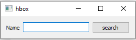
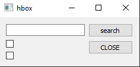
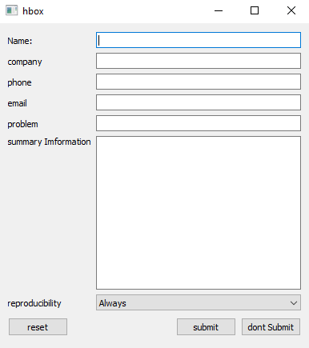

# Hbox Report

# Definition
A **Widgets** is an element of a graphical user interface (GUI) that displays information or provides a specific way for a user to interact with the operating system or an application.
# Programming Widget Layout

 -  [**Dialog1**](#dialog1)
 
    -  [**Dialog1.h**](#dialog1)
 
 -  [**Dialog1 Result**](#dialog1_result)
 
 -  [**Dialog2**](#dialog2)

-  [**Dialog2 Result**](#dialog2_result)

 -  [**Dialog3**](#dialog3)

-  [**Dialog3 Result**](#dialog3_result)
  
## Now we start with creating the **`main`** class 
```c++
int main(int argc, char *argv[])
{
    QApplication a(argc, argv);
auto D = new Dialog1;
D->show();
    return a.exec();
}
```
- #  Dialog1

###  _**Dialog1.h**_

```c++
class Dialog1: public QWidget
{
public:
    explicit Dialog1(QWidget *parent=nullptr);
protected:
    void makeConnexions();
    void createWidgets();
    void placeWidgets();
protected:
    QLabel *label;
    QLineEdit *line;
    QPushButton *search;
    QHBoxLayout *layout;
};
```
###  _**Dialog1.cpp**_

```c++
#include "dialog1.h"
Dialog1::Dialog1(QWidget *parent):QWidget(parent)
{
createWidgets();
placeWidgets();
}
void Dialog1::createWidgets()
{
    label= new QLabel("Name");
    line =new QLineEdit();
    search= new QPushButton("search");
    layout =new QHBoxLayout();
    setLayout(layout);
}

void Dialog1::placeWidgets()
{
    layout->addWidget(label);
    layout->addWidget(line);
    layout->addWidget(search);
}

```
- # Dialog1_Result


- #  Dialog2

### _**Dialog2.h**_

```c++
class Dialog2 : public QWidget
{
public:
    explicit Dialog2(QWidget *parent=nullptr);
protected:
    void makeConnexions();
    void createWidgets();
    void placeWidgets();
     ~Dialog2();
protected:
    QLabel *nameLabel;
    QLineEdit *nameEdit;
    QCheckBox *match;
    QCheckBox *backward;
    QPushButton *search;
     QPushButton *close;
};
```
### _**Dialog2.cpp**_
```c++
Dialog2::Dialog2(QWidget *parent):QWidget(parent)
{
createWidgets();
placeWidgets();
makeConnexions();
//Dialog2 *head=nullptr;
}
Dialog2 :: ~Dialog2()
{
    delete search;
    delete backward;
    delete nameEdit;
    delete nameLabel;
    delete match;
    delete close;
}
void Dialog2::createWidgets()
{
search=new QPushButton("search");
backward=new QCheckBox();
match =new QCheckBox();
nameEdit=new QLineEdit();
nameLabel=new QLabel("Name");
close=new QPushButton("CLOSE");
}
void Dialog2::makeConnexions()
{
    connect(close, &QPushButton::clicked,qApp, &QApplication::exit);
}
void Dialog2::placeWidgets()
{
auto mainLayout =new QHBoxLayout;
auto leftLayout= new QVBoxLayout;
auto topLeftLayout=new QHBoxLayout;
auto rightLayout=new QVBoxLayout;
setLayout(mainLayout);
mainLayout->addLayout(leftLayout);
mainLayout->addLayout(rightLayout);
leftLayout->addLayout(topLeftLayout);
topLeftLayout->addWidget(search);
topLeftLayout->addWidget(nameEdit);
leftLayout->addWidget(match);
leftLayout->addWidget(backward);
rightLayout->addWidget(search);
rightLayout->addWidget(close);
auto policy =new QSizePolicy(QSizePolicy::Fixed,QSizePolicy::Fixed);
rightLayout->addSpacerItem(new QSpacerItem(10,10, QSizePolicy::Expanding));
}
```
- # Dialog2_Result



- #  Dialog3

###  _**Dialog3.h**_
```c++
class Dialog3 : public QWidget
{
public:
   explicit Dialog3(QWidget *parent=nullptr);
protected:
    void makeConnexions();
    void createWidgets();
    void placeWidgets();
protected:
    QLabel *nameLabel;
    QLabel *companyLabel;
    QLabel *phoneLabel;
    QLabel *emailLabel;
    QLabel *problemLabel;
    QLabel *summaryLabel;
    QLabel *reproducibilityLabel;
    QLineEdit *nameEdit;
    QLineEdit *companyEdit;
    QLineEdit *phoneEdit;
    QLineEdit *emailEdit;
    QLineEdit *problemEdit;
    QTextEdit *summaryEdit;
    QComboBox *reproducibility;
    QPushButton *reset;
    QPushButton *submit;
    QPushButton *dontSubmit;
};
#endif // DIALOG3_H
```
###  _**Dialog3.cpp**_
```c++
#include "dialog3.h"
#include <QApplication>
Dialog3::Dialog3(QWidget *parent):QWidget(parent)
{
    createWidgets();
    placeWidgets();
//    makeConnexions();
}
void Dialog3::createWidgets()
{
   nameLabel=new QLabel("Name:");
   companyLabel=new QLabel("company");
   phoneLabel=new QLabel("phone");
   emailLabel=new QLabel("email");
   problemLabel=new QLabel("problem");
   summaryLabel=new QLabel("summary Imformation");
   reproducibilityLabel=new QLabel("reproducibility");
   nameEdit=new QLineEdit();
   companyEdit=new QLineEdit();
   phoneEdit=new QLineEdit();
   emailEdit=new QLineEdit();
   problemEdit=new QLineEdit();
   summaryEdit=new QTextEdit();
   reproducibility=new QComboBox();
   reproducibility->addItem("Always");
   reproducibility->addItem("Sometimes");
   reproducibility->addItem("Rarely");
   reset=new QPushButton("reset");
   submit=new QPushButton("submit");
   dontSubmit=new QPushButton("dont Submit");
}
void Dialog3::placeWidgets(){
    auto mainLayout =new QVBoxLayout;
    auto aLayout= new QHBoxLayout;
    auto raLayout=new QHBoxLayout;
    auto laLayout=new QHBoxLayout;
    auto bLayout=new QHBoxLayout;
    auto rbLayout=new QHBoxLayout;
    auto lbLayout=new QHBoxLayout;
    auto rcLayout=new QHBoxLayout;
    auto lcLayout=new QHBoxLayout;
    auto cLayout=new QHBoxLayout;
    auto dLayout= new QHBoxLayout;
    auto rdLayout=new QHBoxLayout;
    auto ldLayout=new QHBoxLayout;
    auto eLayout=new QHBoxLayout;
    auto reLayout=new QHBoxLayout;
    auto leLayout=new QHBoxLayout;
    auto fLayout=new QHBoxLayout;
    auto gLayout= new QHBoxLayout;
    auto rgLayout=new QHBoxLayout;
    auto lgLayout=new QHBoxLayout;
    auto hLayout=new QHBoxLayout;
    auto lhLayout=new QHBoxLayout;
    auto rhLayout=new QHBoxLayout;
    setLayout(mainLayout);
    mainLayout->addLayout(aLayout);
    mainLayout->addLayout(bLayout);
    mainLayout->addLayout(cLayout);
    mainLayout->addLayout(dLayout);
    mainLayout->addLayout(eLayout);
    mainLayout->addLayout(fLayout);
    mainLayout->addLayout(gLayout);
    mainLayout->addLayout(hLayout);
    //a
    aLayout->addLayout(laLayout);
    aLayout->addLayout(raLayout);
    laLayout->addWidget(nameLabel);
    raLayout->addWidget(nameEdit);
    //b
    bLayout->addLayout(lbLayout);
    bLayout->addLayout(rbLayout);
    lbLayout->addWidget(companyLabel);
    rbLayout->addWidget(companyEdit);
    //c
    cLayout->addLayout(lcLayout);
    cLayout->addLayout(rcLayout);
    lcLayout->addWidget(phoneLabel);
    rcLayout->addWidget(phoneEdit);
    //d
    dLayout->addLayout(ldLayout);
    dLayout->addLayout(rdLayout);
    ldLayout->addWidget(emailLabel);
    rdLayout->addWidget(emailEdit);
    //e
    eLayout->addLayout(leLayout);
    eLayout->addLayout(reLayout);
    leLayout->addWidget(problemLabel);
    reLayout->addWidget(problemEdit);
    //f
    fLayout->addWidget(summaryLabel,0,Qt::AlignTop);
    fLayout->addWidget(summaryEdit,QSizePolicy::Expanding);
    //g
    gLayout->addLayout(lgLayout);
    gLayout->addLayout(rgLayout);
    lgLayout->addWidget(reproducibilityLabel);
    rgLayout->addWidget(reproducibility,1);
    //h
    hLayout->addLayout(lhLayout);
    hLayout->addLayout(rhLayout);
    lhLayout->addWidget(reset);
    rhLayout->addWidget(submit);
    rhLayout->addWidget(dontSubmit);
    //adjusting spaces
    laLayout->addSpacerItem(new QSpacerItem(73,10, QSizePolicy::Fixed,QSizePolicy::Fixed));
    lbLayout->addSpacerItem(new QSpacerItem(61,10, QSizePolicy::Fixed,QSizePolicy::Fixed));
    lcLayout->addSpacerItem(new QSpacerItem(74,10, QSizePolicy::Fixed,QSizePolicy::Fixed));
    ldLayout->addSpacerItem(new QSpacerItem(80,10, QSizePolicy::Fixed,QSizePolicy::Fixed));
    leLayout->addSpacerItem(new QSpacerItem(66,10, QSizePolicy::Fixed,QSizePolicy::Fixed));
    lhLayout->addSpacerItem(new QSpacerItem(80,30, QSizePolicy::Expanding,QSizePolicy::Fixed));
    lgLayout->addSpacerItem(new QSpacerItem(37,0, QSizePolicy::Fixed,QSizePolicy::Fixed));
}
```
- # Dialog3_Result



